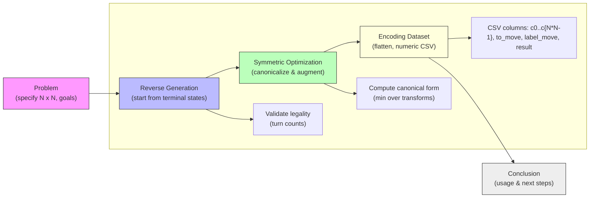

# Dataset Generation Summary

## 1. Problem

This project generates datasets of Tic-Tac-Toe game states for larger boards (4x4, 5x5) to train models that predict moves or outcomes. The dataset must be: representative (covering terminal and mid-game states), compact (avoid duplicates), and efficiently encoded for model consumption (CSV-compatible numeric formats).

Key constraints and goals:
- Boards may be 4x4 or 5x5 (variable N x N).
- We want datasets that include legal positions and labels (next-move indices or final outcome).
- Avoid redundant symmetric duplicates to reduce dataset size while preserving diversity.

## 2. Reverse Generation

Reverse generation is the process of constructing game-state datasets by starting from terminal (end) states and working backwards through legally-reversible moves to produce valid prior states and labeled transitions. This technique often yields:
- Direct access to labeled outcomes (win/draw/lose) tied to positions.
- Balanced coverage of decisive positions by ensuring terminal outcomes are included.

Typical reverse generation algorithm outline:
1. Enumerate terminal board states (winning lines or full board draws).
2. For each terminal state, determine the move that produced it and step back to the predecessor state(s).
3. Continue reversing until reaching initial positions or until a desired depth / number of samples is reached.

Advantages:
- Guarantees correctness of labels for outcome prediction.
- Easier to ensure coverage of terminal/near-terminal positions.

Caveats / edge cases:
- Multiple predecessor moves may lead to the same state — deduplication is required.
- Must validate legality when reversing (player turn alternation, counts of X/O).

## 3. Symmetric Optimization

Boards have geometric symmetries (rotations and reflections). Exploiting these symmetries reduces dataset size without losing unique strategic positions.

Strategy used:
- Define canonical form for a board: choose the lexicographically smallest representation among all symmetry transforms (4 rotations × possible reflections = up to 8 transforms for square boards).
- Store and index only canonical boards during generation.
- When adding dataset rows, either store the canonical state or (preferably) store the original state plus a canonical key; for model invariance you can also augment training with symmetric transforms.

Benefits:
- Reduces duplicates (often by ~8× in highly symmetric cases).
- Improves dataset efficiency and training speed.

Trade-offs:
- If the model is expected to learn asymmetric patterns (e.g., positional biases), heavy canonicalization may strip useful orientation signals — in that case, prefer deduplication but keep orientation as an augmentation option.

## 4. Encoding Dataset

Goal: produce a CSV-friendly numeric encoding that models can read directly.

Recommended encoding conventions (used across the repo datasets):
- Flatten the board in row-major order into N*N columns named `c0, c1, ..., c{N*N-1}`.
- Cell values: X = 1, O = -1, empty = 0. This numeric scheme is compact and centers the data.
- Additional columns:
  - `to_move` — 1 if X to move, -1 if O to move (optional but helpful).
  - `label_move` — integer index of the correct next move (0..N*N-1) or -1 when no legal move (terminal); used for move prediction tasks.
  - `result` — outcome from the perspective of X: 1 (X win), 0 (draw), -1 (O win). Useful for outcome prediction.
  - `canonical` — optional string key (or integer id) for canonical form used to dedupe.

CSV layout example (4x4, N=4):

Header: c0,c1,...,c15,to_move,label_move,result,canonical

Example row (4x4):
- Board (rows):
  X . . O
  . X O .
  . . X .
  . . . .
- Flatten row-major and encode (X=1,O=-1,.=0):
  c0=1,c1=0,c2=0,c3=-1,...,c15=0
- to_move=1 (X to move)
- label_move=14 (for example)
- result=1 (X eventually wins)
- canonical=R0 (example canonical id)

Notes on variable board sizes:
- For 5x5 (N=5) follow the same pattern but with columns c0..c24.
- Keep the header consistent; models can accept variable-length boards by separate files or by padding+masking.

Encoding alternatives (if needed):
- One-hot per cell (3 channels): more explicit but increases width by 3×.
- Two-channel binary (X, O) plus to_move scalar: common for convolutional nets.

## Mermaid diagram

Below is a pipeline diagram that captures the flow from the problem to the dataset output.

## 5. Conclusion

What we achieved and recommended next steps:
- Reverse generation + canonicalization yields a compact, correct dataset emphasizing terminal positions.
- The numeric CSV encoding (X=1,O=-1,empty=0) is compact and works for both move-prediction and outcome prediction.

Next practical steps:
- Confirm the `generate_v1_3.py` reverse-generation script writes CSV rows following the header described above.
- Add a small test script that loads a generated CSV row and validates: counts of X/O, legal to_move value, and that `label_move` is a legal empty cell index.
- Optionally export an augmented dataset with symmetric transforms to train orientation-invariant models.

---

Files produced / touched:
- `summary.md` — this file (high-level summary and diagram)

If you'd like, I can:
- Update `generate_v1_3.py` to emit the exact CSV header and examples shown above.
- Add a `validate_dataset.py` script that scans CSVs in the repo and reports invalid rows.

Which follow-up would you prefer?